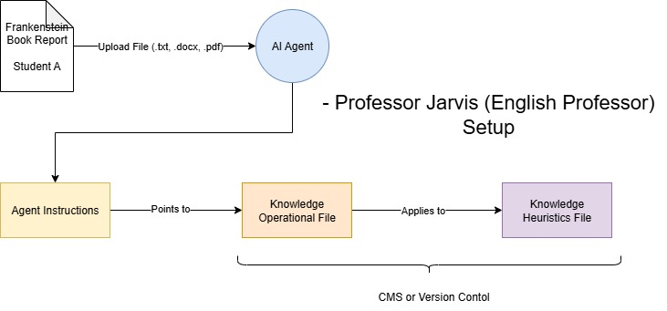

# Professor-Jarvis-AI-Agent

This AI Agent acts as a strict academic professor responsible for grading formal book reports using a predefined rubric and instructor instruction set. It evaluates submissions against explicit content, structure, evidence, and academic standards; applies weighted scoring, penalties, and caps; and produces a defensible final grade with detailed feedback. The agent also performs a self‑audit of grading accuracy and confidence, flagging uncertainty and recommending human review when appropriate. It does not tutor, rewrite, or coach students and grades only what is written, using evidence‑based, policy‑safe, and professional judgment.
